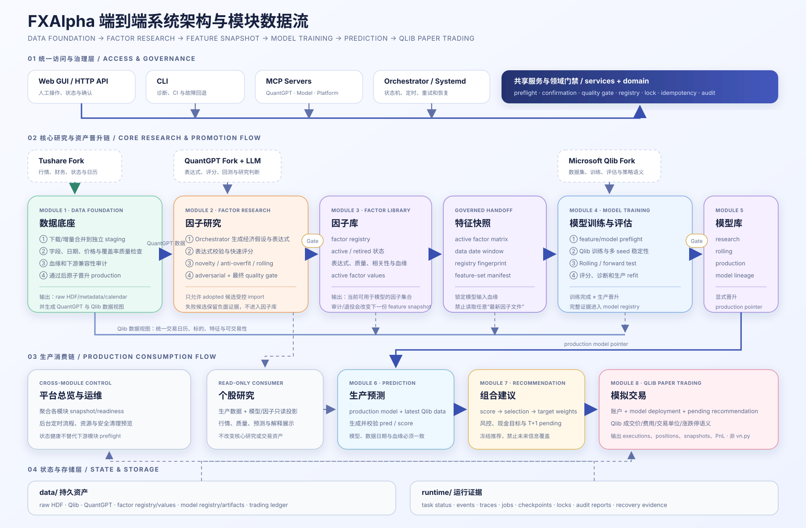
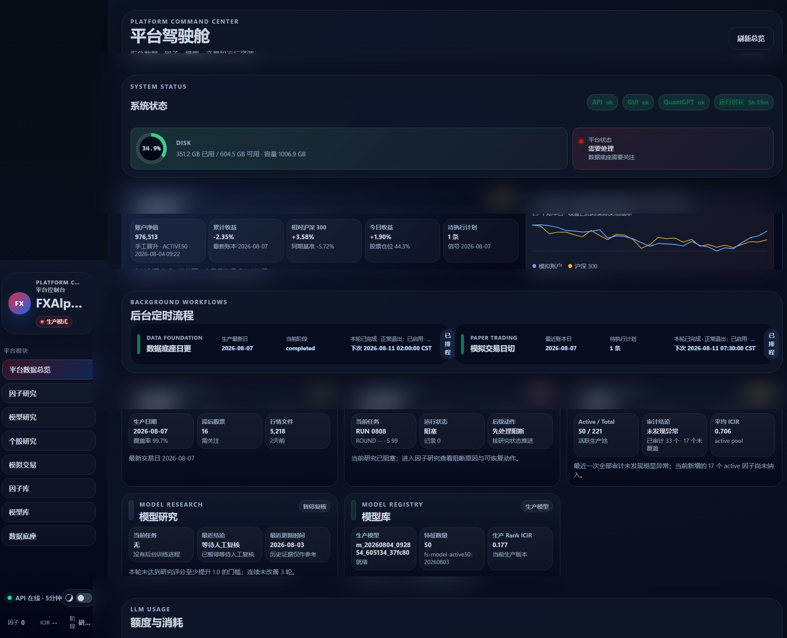

# FXAlpha

**English** | [简体中文](README.zh-CN.md)

A governed quantitative-research platform that connects market data, factor
research, model training, prediction, and Qlib paper trading. GUI, CLI, MCP,
and scheduled automation share the same services, gates, registries, and audit
records.

> **Start here:** use the [complete User Guide](docs/USER_GUIDE.md) to operate
> the platform. Use [Business Workflows and Calculation Logic](docs/BUSINESS_WORKFLOWS.md)
> to understand every stage, calculation, score, import/promotion gate, risk
> cap, and Qlib execution rule.

> **Alpha-stage research and paper-trading software.** FXAlpha does not provide
> investment advice, guarantee factor or model performance, or include a
> public-edge authentication gateway or live-trading execution contract.

## Understand the platform in five minutes

FXAlpha turns a set of easily disconnected research steps into a traceable
production workflow:

1. Market data is built in staging and promoted only after quality and lineage
   checks pass.
2. Factor candidates pass expression validation, scoring, novelty, rolling
   validation, and a quality gate before registry import.
3. Models consume a fingerprinted active feature snapshot; completed training
   is not automatic production promotion.
4. Prediction and recommendation consume a promoted model through date and
   provenance gates.
5. Paper accounts are isolated by model deployment and use Qlib exchange
   semantics.
6. Writes requested by GUI, CLI, MCP, or a timer reach the same services and
   evidence trail.

The public repository includes source, tests, sanitized examples, and docs. It
includes **no reusable market dataset, factor values, trained models, account
database, or API keys**. The owner-approved UI captures below are point-in-time
documentation, not importable runtime assets. Users configure licensed data
and credentials outside Git.

## Feature and documentation map

README explains what exists and where to start. Detailed algorithms are
maintained once in [Business Workflows and Calculation Logic](docs/BUSINESS_WORKFLOWS.md):
Chapter 2 covers data, Chapter 3 factor mining, Chapter 4 model training,
Chapter 5 prediction/recommendation, and Chapter 6 Qlib paper trading.

| Goal | GUI page | First action | Full documentation |
| --- | --- | --- | --- |
| Find what needs attention | Platform overview | Read API, data date, lane state, and blocker | [User guide](docs/USER_GUIDE.md) · [Platform operations](docs/PLATFORM_OPS_RUNBOOK.md) |
| Prepare market data | Data foundation | Read preflight, build staging, review, then promote | [Business logic Ch. 2](docs/BUSINESS_WORKFLOWS.md) · [Data workflow](docs/DATA_FOUNDATION_WORKFLOW_CURRENT.md) · [Daily runbook](docs/DATA_FOUNDATION_DAILY_RUNBOOK_CURRENT.md) |
| Discover and govern factors | Factor research / library | Inspect current run/round/stage and blocker | [Business logic Ch. 3](docs/BUSINESS_WORKFLOWS.md) · [Factor operations](docs/FACTOR_RESEARCH_OPERATIONS.md) · [Factor contract](domain/factor_research/README.md) |
| Train and evaluate models | Model research / registry | Verify active feature snapshot and model preflight | [Business logic Ch. 4](docs/BUSINESS_WORKFLOWS.md) · [Model workflow](docs/MODEL_RESEARCH_WORKFLOW_CURRENT.md) · [Model module](domain/model/README.md) |
| Build prediction and targets | Model research / paper trading | Verify production model, prediction date, and provenance | [Business logic Ch. 5](docs/BUSINESS_WORKFLOWS.md) · [Paper fleet contract](docs/PRODUCTION_MULTI_MODEL_PAPER_TRADING_CURRENT.md) |
| Operate Qlib paper accounts | Paper trading | Review fleet preflight and replay plan before writes | [Business logic Ch. 6](docs/BUSINESS_WORKFLOWS.md) · [Operator runbook](docs/TRADING_RECOMMENDATION_RUNBOOK_CURRENT.md) · [Qlib execution contract](docs/QLIB_LIMIT_TRADING_CONTRACT_CURRENT.md) |
| Govern through agents | MCP | Configure QuantGPT, Model, and Platform MCP | [Platform MCP](docs/PLATFORM_GOVERNANCE_MCP_CURRENT.md) · [LLM integration](docs/LLM_INTEGRATION.md) |
| Deploy or publish | CLI / docs | Start in isolation and run release preflight | [Local deployment](docs/LOCAL_DEPLOYMENT.md) · [GitHub upload](docs/GITHUB_UPLOAD_RUNBOOK.md) |

## System architecture and module flow



The main chain follows governed assets rather than GUI pages:

- data foundation reviews Tushare staging, promotes it, and produces QuantGPT
  and Qlib data views;
- factor research consumes QuantGPT data and imports only quality-gate adopted
  candidates into the factor library;
- the factor library builds a registry-fingerprinted active feature snapshot
  for model training;
- Qlib training, Rolling, forward tests, and promotion populate the model
  registry and production pointer;
- the production model and latest Qlib data generate prediction and portfolio
  recommendations for Qlib paper accounts.

See [Architecture](docs/ARCHITECTURE.md) for boundaries, storage ownership, and
known technical debt.

## Real system interface



This is a point-in-time runtime view approved by the project owner for public
release. See the [System interface gallery](docs/SCREENSHOTS.md) for complete
factor-research, model-research, and Qlib paper-trading captures and an
explanation of what each page means. Calculation rules remain normative in
[Business Workflows and Calculation Logic](docs/BUSINESS_WORKFLOWS.md).

## Clone and first start

Linux/WSL2, Python 3.11 or 3.12, and Git submodules are supported.

```bash
git clone --recurse-submodules https://github.com/whr1999/FXAlpha.git
cd FXAlpha
cp config.example.yaml config.yaml
./scripts/bootstrap_public_env.sh
```

If the third-party forks were not initialized:

```bash
git submodule update --init --recursive
```

Keep credentials in the ignored `config.yaml`, or point
`FXALPHA_CONFIG_FILE` at a protected external configuration file. Never store
real tokens in an example.

Start API and GUI:

```bash
PYTHONPATH=. .venv/bin/python api_server.py --host 127.0.0.1 --port 18081
```

Open `http://127.0.0.1:18081/gui/`, then proceed in this order:

1. Confirm that the API is online and overview loading finishes.
2. Check whether licensed data exists and data production health is ready.
3. If data is not ready, stop at the data lane—do not start factor, model, or
   trading writes.
4. After data is ready, inspect the factor library, active feature snapshot,
   and production model in order.
5. Create or advance a paper account only after trading preflight passes.

A fresh clone has no production data. `not configured`, `waiting`, or `blocked`
is therefore an honest first-run state, not an installation failure.

## Common read-only checks

```bash
.venv/bin/python cli.py data-status
.venv/bin/python cli.py factor-status
.venv/bin/python cli.py model-status
.venv/bin/python cli.py pred-status
.venv/bin/python cli.py paper-fleet-status
.venv/bin/python cli.py paper-fleet-preflight
```

List every entrypoint:

```bash
.venv/bin/python cli.py --help
```

Staging creation, factor import, model promotion, account creation, fleet/replay
execution, and cleanup execution are writes. Do not copy commands blindly:
read preflight, verify the target and date boundary, and follow the lane's
runbook.

## Three operating surfaces

| Surface | Recommended use | Do not use it to |
| --- | --- | --- |
| GUI | Human observation, preflight, approval, recovery, and explanation | Reimplement business formulas or bypass backend gates |
| CLI | Local development, CI, read-only diagnosis, and explicit failure fallback | Become an unaudited production shortcut |
| MCP | Governed factor/model research and platform automation | Replace missing native tools with curl or temporary glue scripts |

`.codex/config.example.toml` contains relative-path examples. Personal Codex
configuration, Skills, memories, transcripts, approval settings, and
credentials are not repository assets.

## Public repository and local asset boundary

Apart from the individually owner-approved static UI records above, this
repository does not publish:

- market datasets or derived factor values;
- active factor/model registries, feature snapshots, or trained artifacts;
- downloadable or reusable predictions, recommendations, holdings, account
  snapshots, NAV, or P&L data;
- SQLite databases, task evidence, traces, logs, backups, or runtime state;
- API keys, tokens, `.env`, real `config.yaml`, or personal absolute paths;
- personal Codex Skills, memories, transcripts, or local tooling state.

Git ignore rules reject these paths, and separate audits scan both the public
tree and reachable Git history.

## Documentation

### New users

- [Complete user guide](docs/USER_GUIDE.md)
- [Business workflows and calculation logic](docs/BUSINESS_WORKFLOWS.md)
- [System interface gallery](docs/SCREENSHOTS.md)
- [Local deployment](docs/LOCAL_DEPLOYMENT.md)
- [Architecture](docs/ARCHITECTURE.md)

### Platform operations

- [Data foundation daily runbook](docs/DATA_FOUNDATION_DAILY_RUNBOOK_CURRENT.md)
- [Factor research operations](docs/FACTOR_RESEARCH_OPERATIONS.md)
- [Model research workflow](docs/MODEL_RESEARCH_WORKFLOW_CURRENT.md)
- [Paper-trading operator runbook](docs/TRADING_RECOMMENDATION_RUNBOOK_CURRENT.md)
- [Platform operations](docs/PLATFORM_OPS_RUNBOOK.md)

### Development and GitHub publication

- [Project structure](docs/PROJECT_STRUCTURE_CURRENT.md)
- [Engineering guardrails](docs/CODEX_ENGINEERING_GUARDRAILS.md)
- [Third-party fork policy](docs/THIRD_PARTY_FORKS.md)
- [vn.py retirement](docs/VNPY_RETIREMENT.md)
- [Publication readiness](docs/GITHUB_PUBLICATION_READINESS.md)
- [GitHub upload runbook](docs/GITHUB_UPLOAD_RUNBOOK.md)
- [Verification report](docs/VERIFICATION_REPORT_20260810.md)
- [Current documentation index](docs/DOCUMENTATION_INDEX_CURRENT.md)

## Publication verification

```bash
.venv/bin/python scripts/run_release_preflight.py
```

The consolidated gate checks the public tree, reachable Git history, pinned
fork topology, source compilation, and the full test suite. Network release
mode additionally requires anonymous access to the exact public fork commits
and a fresh recursive clone.

## Third-party components, license, and security

- The QuantGPT fork supplies factor research and MCP tools.
- The Microsoft Qlib fork supplies modeling, evaluation, and paper-exchange
  semantics.
- The Tushare fork supplies the market-data SDK.

Each component retains its own license; see [NOTICE](NOTICE) and submodule
license files. FXAlpha is currently source-visible under an all-rights-reserved
project license and must not be described as open source under the current
terms.

Report vulnerabilities with a private GitHub security advisory. Never paste
credentials, production data, factor values, model files, unreviewed account
screenshots, or private logs into a public issue.
