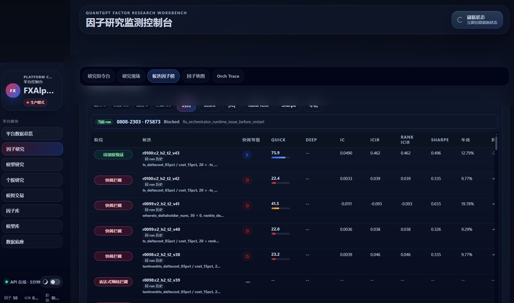
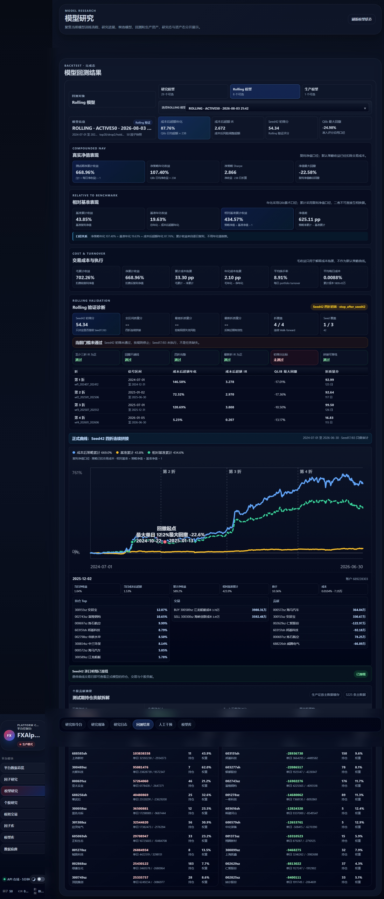
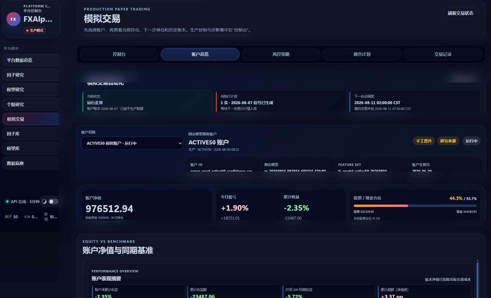

# FXAlpha 系统界面

这些截图用于说明平台各模块怎样衔接，不替代安装说明、业务合同或测试结果。它们是
经项目所有者明确批准公开的 **2026-08-10 时点真实界面记录**，因此画面中的状态和
统计值会随运行变化，不应被理解为新环境安装后的预置数据，也不代表收益承诺。

图片已检查：未发现 API Key、Token、登录凭据、本地文件路径或设备元数据。仓库用
[`manifest.json`](assets/screenshots/manifest.json) 固定文件名、尺寸、字节数和
SHA-256；替换图片后必须重新人工审查并更新清单。

## 1. 平台数据总览

驾驶舱把数据、因子、模型、预测、模拟交易和后台流程放在同一个状态面上。这里用于
定位哪个业务 lane 已就绪、等待或阻断；它不是绕过各模块 preflight 的操作入口。

详细说明：[完整使用指南](USER_GUIDE.zh-CN.md) ·
[平台运维手册](PLATFORM_OPS_RUNBOOK.md)

## 2. 因子研究

因子页面显示研究 run、round、stage、候选表达式、评分和阻断原因。候选出现在页面上
并不等于已经入库；只有表达式、Quick、查重、Rolling、Deep 和质量门禁全部通过，
才允许写入因子注册表。

详细说明：[业务流程第 3 章](BUSINESS_WORKFLOWS.zh-CN.md) ·
[因子研究操作手册](FACTOR_RESEARCH_OPERATIONS.md)

## 3. 模型研究

模型页面把特征快照、训练任务、Rolling/forward 结果、风险指标和晋升状态放在一起。
训练完成、评估通过和成为 production model 是三个不同状态；预测和模拟交易只消费
已经晋升且血缘一致的模型。

详细说明：[业务流程第 4 章](BUSINESS_WORKFLOWS.zh-CN.md) ·
[模型研究工作流](MODEL_RESEARCH_WORKFLOW_CURRENT.md)

## 4. Qlib 模拟交易

模拟交易页面按账户和模型 deployment 展示资金、持仓、建议、风控和成交结果。当前
执行引擎是 Qlib paper exchange，不依赖 vn.py；任何推进操作仍需先通过 fleet
preflight、日期、模型、预测和风险门禁。

详细说明：[业务流程第 6 章](BUSINESS_WORKFLOWS.zh-CN.md) ·
[模拟交易值守手册](TRADING_RECOMMENDATION_RUNBOOK_CURRENT.md)
